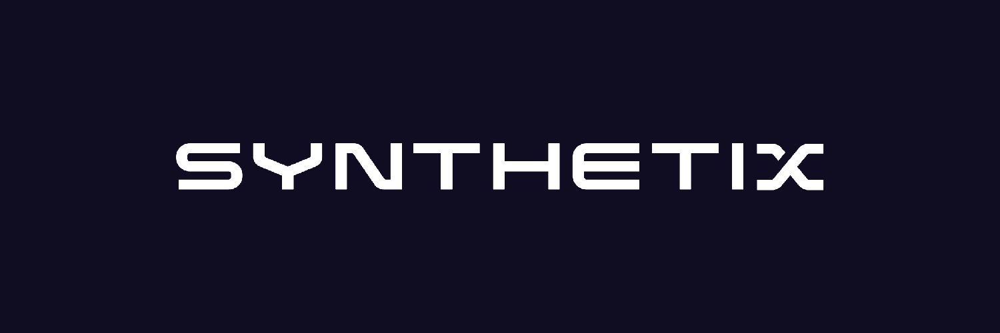

# Synthetix: A Comprehensive Case Study on DeFi and Synthetic Assets

## Overview and Origin

- **Project Name:** Synthetix
- **Launch Date:** Founded in September 2017 as Havven, rebranded to Synthetix in November 2018
- **Founders:** Kain Warwick and Justin J. Moses
- **Origin of Idea:** The founders recognized the potential of decentralized finance (DeFi) and wanted to create a platform that would allow users to access a wide range of financial assets without the limitations of traditional financial systems.
- **Funding:** Synthetix has raised a total of $30 million in funding through token sales and venture capital investments, including a $12 million investment from top venture capital firms such as Framework Ventures, Coinbase Ventures, and IOSG Ventures.

## Business Activities

- **Financial Problem:** Synthetix is a DeFi protocol that supports the creation and trading of synthetic assets (called synths). These synthetic assets can cover various fields, such as stocks, cryptocurrencies, foreign exchange, commodities, indices, and interest rates. The Synthetix ecosystem revolves around sUSD (stablecoin) and offers a wide range of financial services.
- **Intended Customer:** Synthetix targets individuals and institutions interested in DeFi and trading synthetic assets. The potential users includes cryptocurrency traders, Tradfi traders, and investors worldwide. Users can buy an unlimited amount of Synthetic assets (like $TSLA, $BTC) without any slippage, all executed at current market price – this is called "*zero slippage trading*."
- **Unique Solution:** Synthetix's platform offers a unique approach to trading synthetic assets by leveraging blockchain technology and smart contracts. It allows users to mint, trade, and manage synthetic assets that track the value of real-world assets, such as stocks, commodities, and currencies. 
>1. One of the fundamental mechanisms is that users can *mint $sUSD by staking $SNX*. These sUSD can be spent like 1 US dollar (synthetic US dollar), but they also represent users' debt. sUSD can be traded for other synthetic assets with zero slippage. 
>2. The active debt pool is a unique and core design feature of Synthetix. "Active debt" refers to the fact that users' and the system's liabilities are constantly changing. When a user stakes SNX to mint sUSD, the minted sUSD is considered new debt generated by the system. Once the sUSD is traded for other synths, the debt also increases or decreases with the appreciation or depreciation of the synths. The system's debt is always collectively borne by all SNX stakers on a pro-rata basis. As a result, even a user who only participates in minting sUSD without making any other transactions will experience active changes in their debt.

- **Technologies Used:** Synthetix is built on the Ethereum blockchain and utilizes smart contracts, oracles (provided by Chainlink), and its native token (SNX) for collateralization, staking, and governance.

## Landscape

- **Financial Domain:** Synthetix operates in the DeFi & Blockchain domain, specifically within the synthetic assets and derivatives trading sector.
- **Major Trends and Innovations:** Over the last 5-10 years, the DeFi domain has experienced rapid growth, with innovations such as decentralized lending, borrowing, and trading platforms. Synthetic assets have emerged as a popular solution to provide users with exposure to real-world assets without the need for intermediaries or direct ownership.
- **Major Competitors:** Some major competitors in the synthetic assets space include UMA Protocol, dYdX, and Mirror Protocol.

## Results

- **Business Impact:** Synthetix has become a major player in the DeFi and synthetic assets landscape, with a total value locked (TVL) exceeding $2 billion at its peak. The platform has facilitated billions of dollars in trading volume and has attracted a significant user base.
- **Core Metrics:** Companies in this domain typically measure success by metrics such as TVL, trading volume, and user growth. Synthetix has consistently performed well in these areas, positioning itself as a leader in the synthetic assets market.
- **Performance Relative to Competitors:** Synthetix's performance has been strong compared to its competitors, with a higher TVL and trading volume than many other synthetic asset platforms.

## Recommendations

- **Suggested Product/Service:** In the existing Synthetix V2, all transactions go through a single SNX debt pool, which restricts many features due to potential risks. Synthetix should introduce the concept of *isolated debt pools*, allowing stakers to customize risk exposure for specific markets, leading to differentiated risks and returns for debt pools. 
- **Benefits:** This offering will provide users with greater flexibility and control over their risk exposure, enabling them to engage in strategies that match their specific risk tolerance and investment goals. It would cater to more advanced traders, potentially attracting more users and increasing trading volume on the platform. 
- **Technologies Utilized:** The implementation of isolated debt pools would require modifications to the existing Synthetix smart contracts to accommodate the management of multiple debt pools, each with its own risk parameters and collateral requirements. 
